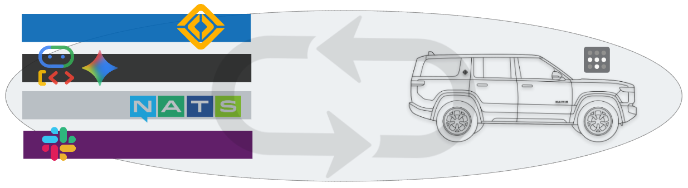
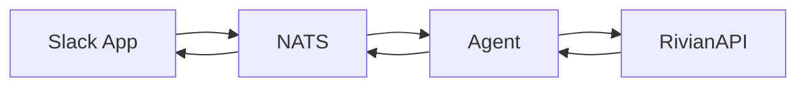

# rivian-slack-nats-bridge
Enables talking to your Rivian via a Slack App with AI Enriched Responses

## Overview

This project bridges Slack and Rivian via NATS. It allows you to interact with your Rivian through a Slack app, with AI-enriched responses. The system consists of two main components:

- **slack2nats**: A Slack app that listens for messages and forwards them to NATS.
- **nats2rivian**: A NATS consumer that listens for messages and interacts with your Rivian.

## Architecture

## Prerequisites

- A Slack app with the necessary permissions.
- A NATS server.
- A Rivian account.
- A Rivian maybe.   

## Installation

See the [helm chart](chart/rivian-slack-nats-bridge/README.md) for installation instructions.